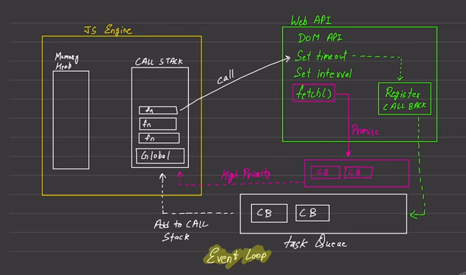

# JavaScript Runtime and Event Loop Explained

This document explains the JavaScript runtime system including the Event Loop, Call Stack, Web APIs, and queues used for asynchronous processing.

---

## 💡 JavaScript Overview

- **Synchronous**: Executes one line of code at a time in the order it appears.
- **Single-threaded**: Only one task executes at a time in a single thread.

---

## 🧠 JS Engine

### Components:

1. **Memory Heap**:
   - Used for storing variables and objects.

2. **Call Stack**:
   - Stack structure where each execution context is pushed when a function is invoked and popped after completion.
   - Contains:
     - Global context (`Global`)
     - Function contexts (`fn`, `fn`, etc.)

---

## 📞 Call Flow & Execution Context

1. JavaScript executes code **line-by-line**.
2. For each function call, an **Execution Context** is created and pushed to the **Call Stack**.
3. Once the function is done executing, it is **popped** from the stack.

> 🔁 Note: Each line **waits for the previous** one to complete — this is **blocking behavior** for synchronous code.

---

## 🧱 Blocking vs Non-Blocking Code

### Blocking Code:
- Example: `readFileSync`
- Blocks the thread until the operation is complete.
- Nothing else runs meanwhile.

### Non-Blocking Code:
- Example: `readFileAsync`, `setTimeout`, `fetch`
- Delegated to Web APIs (in browser or Node.js)
- Registers a callback and continues to next line of code (non-blocking).

---

## 🌐 Web APIs

Handles asynchronous operations like:
- **DOM API**
- **setTimeout / setInterval**
- **fetch()**

### Flow:
1. JS calls an async function (`fetch()`).
2. Control goes to Web API which starts the request.
3. Web API **registers a callback** to be called later (like after timeout or when data is fetched).
4. If it’s a `Promise`, callback is placed in **Microtask Queue**.
5. For timers or DOM events, it goes to the **Task Queue**.

---

## ⚙️ Microtask Queue

- Used for high-priority tasks, mostly **Promise callbacks**.
- Always gets preference over the Task Queue.

Example: `fetch().then(callback)` → this callback goes into **Microtask Queue**.

---

## 📥 Task Queue

Also called the **Callback Queue**.

- Holds callbacks from:
  - `setTimeout`, `setInterval`
  - DOM Events

These are queued after the Call Stack is empty and Microtask Queue is drained.

---

## 🔄 Event Loop

The **heart** of the JS runtime — constantly watches:

1. If **Call Stack is empty**
2. Then:
   - First runs all **Microtasks (Promise callbacks)** from the **Microtask Queue**
   - Then runs one task from the **Task Queue**

This keeps repeating as long as there are tasks or microtasks left.

---

## 🧠 In Summary

1. JS starts executing synchronous code from top to bottom (line-by-line).
2. Async calls (like `setTimeout`, `fetch`) are handed over to Web APIs.
3. Once their task is done, they queue their callbacks.
4. The **Event Loop** ensures that:
   - Microtask Queue runs first (Promise-based tasks).
   - Then one callback from Task Queue.